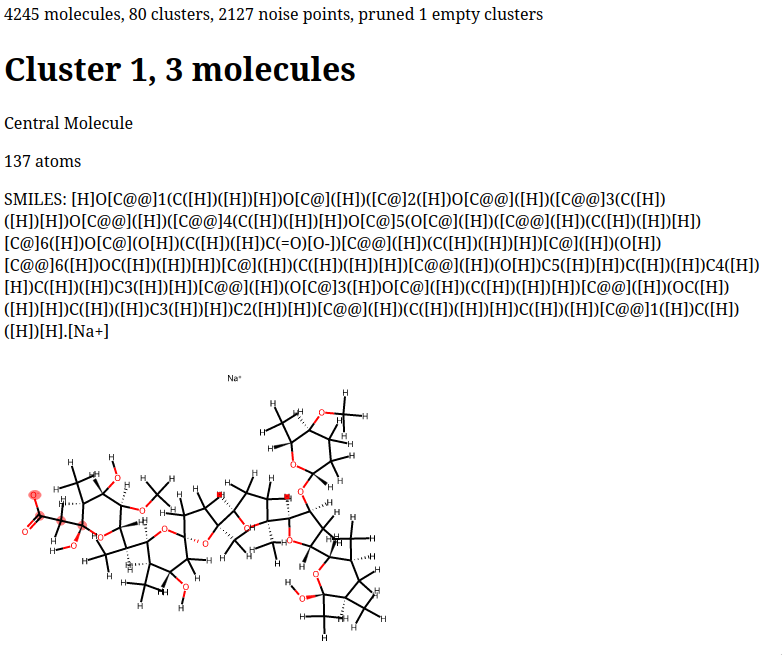

# chembl-search
searching the ChEMBL database for molecules matching SMARTS patterns

## Usage

Currently, the dependency paths in `Cargo.toml` are hard-coded relative paths to
other projects on my computer. You can of course edit these manually, but if you
want to use this project, let me know, and I will change them to GitHub paths.
In addition to these dependencies, you also need to have an active conda
environment with the [openff-toolkit][offtk] installed and a local build of
[rdkit][rdkit]. See the [Makefile](./Makefile) for how to set your
`LD_LIBRARY_PATH` correctly.

### Main search

``` shell
cargo run --release -- \
	  --molecule-file chembl_33.sdf \
	  --search-params want.params \
	  --write-output
```

This command reads `chembl_33.sdf` located in the current directory, searching
for matches to SMIRNOFF parameters listed in `want.params`, and writes one
`pid.smiles` output file for each parameter in `want.params`. You can obtain a
gzipped version of the ChEMBL 33 database [here][chembl]. However, nothing
should be ChEMBL specific, and the program should run on any valid SDF file. The
format of `want.params` is quite simple, one parameter identifier per line:

``` text
t18a
t18b
t87a
t123
t123a
t138a
```

The lines are trimmed of leading and trailing whitespace but otherwise
unaltered. The default OpenFF force field from which these parameters and their
SMIRKS are extracted is `openff-2.1.0.offxml` (Sage 2.1.0). You can change this
to any built-in force field or file readable by the [openff-toolkit][offtk] with
the `--forcefield/-f` flag. Similarly, if you want to look at parameters other
than `ProperTorsions`, you can pass a different parameter handler type via the
`--parameter-type/-p` flag.

By default, the search uses all available CPU cores, but you can adjust this
with the `--threads/-t` flag. You'll want it to be pretty high because it takes
~8 minutes on my 16 core desktop. Also be sure to use the `--release` flag or it
will take more like 2 hours.

### Clustering

Once you have output files from the main search, you can use the `fingerprint`
binary to process the raw SMILES output into an HTML report. Example use looks
like:

``` shell
cargo run --bin fingerprint --release -- \
	  t18a.smiles --min-pts 10 --parameter t18a
```

This reads the file `t18a.smiles` in the current directory, generates Morgan
fingerprints with the default radius of 4 and length 1024 for each of the
corresponding molecules, computes the [Tanimoto][tanimoto] distance matrix for
the molecules, and performs a [DBSCAN][dbscan] clustering before producing an
HTML report summarizing the output. You can see the top of an example output
file (for a horrifying SMILES string) below.



Again, you can modify the parameters for the clustering and drawing using
command line flags. These flags alter the behavior of the atom highlighting code
and only apply when the `--parameter/-p` is supplied. Otherwise, no atoms are
highlighted in the generated images.

- `--forcefield` changes the OpenFF force field
- `--parameter` changes the parameter identifier
- `--parameter-type` changes the parameter handler type

These flags alter the parameters for the DBSCAN algorithm:

- `--epsilon` sets the maximum cluster radius
- `--min-pts` sets the minimum cluster size

And this flag alters the Morgan fingerprinting:

- `--radius` sets the Morgan fingerprinting radius

<!-- Footnotes -->
[chembl]: https://ftp.ebi.ac.uk/pub/databases/chembl/ChEMBLdb/releases/chembl_33/
[offtk]: https://github.com/openforcefield/openff-toolkit
[rdkit]: https://github.com/rdkit/rdkit
[dbscan]: https://en.wikipedia.org/wiki/DBSCAN
[tanimoto]: https://en.wikipedia.org/wiki/Jaccard_index
